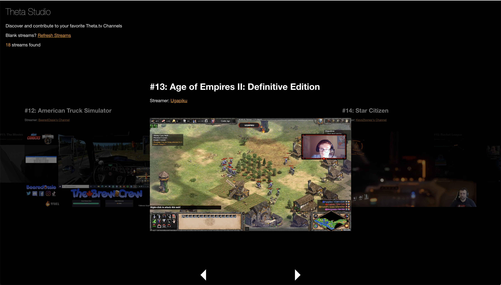

## Theta Studio

Theta Studio simulates a movie theatre like environment for discovering and playing your favorite live theta streamers.

Build for the Theta 2021 integration hackathon. This could be integrated into Theta as a part of their core product, or serve as a standalone app.

## What it does

- Uses theta API's to return a list of live streams based on categories
- Renders live streams in a carousel / explorer format.
- Allows toggling between theta categories
- No user accounts required.
- Allows users to focus on live streams without having to search through pre-recorded content.

## What we learned

How to integrate live theta streams into a react application

## Future work

- Optional user login for tfuel
- Full screen mode
- Voting and reviews
- More categories and configurable layouts
- Persistent database of indexed categories
- Dynamic categories

### Notes

- Browse theta streams minimally without comments or user accounts
- Enter theatre mode to view the stream full screen.

### Run the project

`yarn && yarn start`

    

